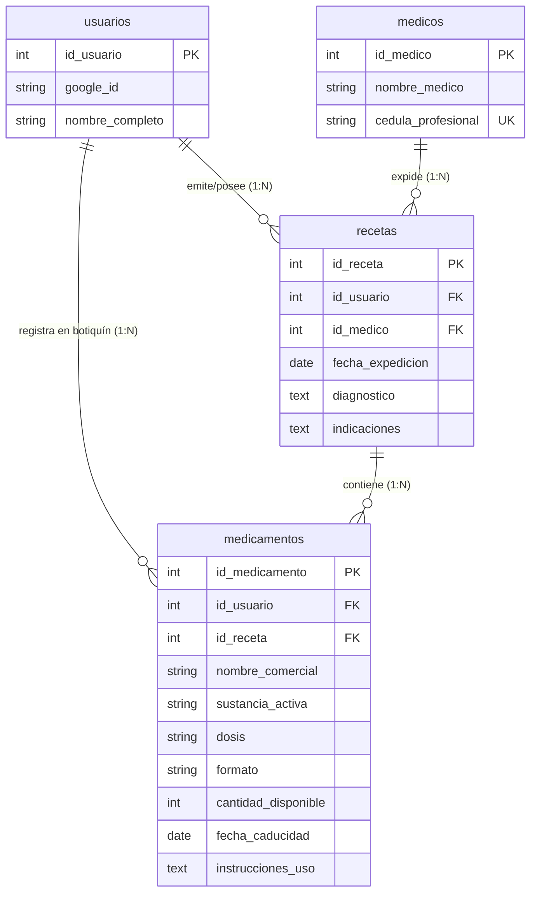

# Explicación de Relaciones de la Base de Datos (`bdi_database`)

Este documento describe la arquitectura de la base de datos, el Modelo Entidad-Relación (DER), las llaves foráneas y el comportamiento del almacenamiento de recetas médicas y medicamentos.

---

## 1. Diagrama Entidad-Relación (ER)



---

## 2. Detalle de las Tablas y Sus Llaves Foráneas

### A. Tabla `usuarios`
* **Rol:** Almacena la información de los usuarios/pacientes autenticados.
* **Llave Primaria (PK):** `id_usuario`.

### B. Tabla `medicos`
* **Rol:** Registra la información de los profesionales de la salud.
* **Llave Primaria (PK):** `id_medico`.
* **Llave Única (UK):** `cedula_profesional` (Evita registros duplicados del mismo médico).

### C. Tabla `recetas`
* **Rol:** Funciona como la cabecera de la consulta o receta médica expedida.
* **Llave Primaria (PK):** `id_receta`.
* **Llaves Foráneas (FK):**
  1. `id_usuario` ➔ Vincula la receta con la tabla `usuarios(id_usuario)`.
     - *Regla:* `ON DELETE CASCADE ON UPDATE CASCADE` (Si se elimina un usuario, se eliminan sus recetas).
  2. `id_medico` ➔ Vincula la receta con la tabla `medicos(id_medico)`.
     - *Regla:* `ON DELETE SET NULL ON UPDATE CASCADE` (Si se elimina un médico, la receta conserva su registro marcando el campo médico como `NULL`).

### D. Tabla `medicamentos`
* **Rol:** Almacena los medicamentos individuales prescritos en una receta o añadidos al botiquín personal.
* **Llave Primaria (PK):** `id_medicamento`.
* **Llaves Foráneas (FK):**
  1. `id_usuario` ➔ Vincula el medicamento con la tabla `usuarios(id_usuario)`.
     - *Regla:* `ON DELETE CASCADE ON UPDATE CASCADE`.
  2. `id_receta` ➔ Vincula el medicamento con la receta específica `recetas(id_receta)`.
     - *Regla:* `ON DELETE CASCADE ON UPDATE CASCADE` (Si se elimina una receta, se eliminan los medicamentos asociados a esa receta).

---

## 3. Flujo de Datos al Guardar una Receta Escaneada

Cuando el usuario confirma la receta escaneada en el Frontend, la petición transaccional `POST /api/recetas/guardar` realiza los siguientes pasos en MySQL:

```
[ FRONTEND ] --( JSON de Receta )--> [ BACKEND (recetaController.js) ]
                                                   |
                                       +-----------+-----------+
                                       | TRANSACCIÓN MySQL     |
                                       +-----------+-----------+
                                                   |
  1. Verifica/Inserta en `medicos` ---------------> [ Tabla medicos ] (Obtiene id_medico)
                                                   |
  2. Inserta Cabecera de Receta -----------------> [ Tabla recetas ] (Obtiene id_receta)
                                                   |
  3. Bucle INSERT por cada medicamento -----------> [ Tabla medicamentos ] (Vincula id_usuario e id_receta)
                                                   |
                                            [ COMMIT / ROLLBACK ]
```

---

## 4. Ejemplo de Consultas de Verificación (SQL JOINs)

### Consultar el historial completo de un usuario con sus médicos y medicamentos:

```sql
USE bdi_database;

SELECT 
    r.id_receta,
    r.fecha_expedicion,
    r.diagnostico,
    r.indicaciones AS indicaciones_receta,
    m.nombre_medico,
    m.cedula_profesional,
    med.id_medicamento,
    med.nombre_comercial,
    med.sustancia_activa,
    med.dosis,
    med.formato,
    med.instrucciones_uso AS instruccion_medicamento
FROM recetas r
INNER JOIN medicos m ON r.id_medico = m.id_medico
INNER JOIN medicamentos med ON r.id_receta = med.id_receta
WHERE r.id_usuario = 1
ORDER BY r.fecha_expedicion DESC;
```
