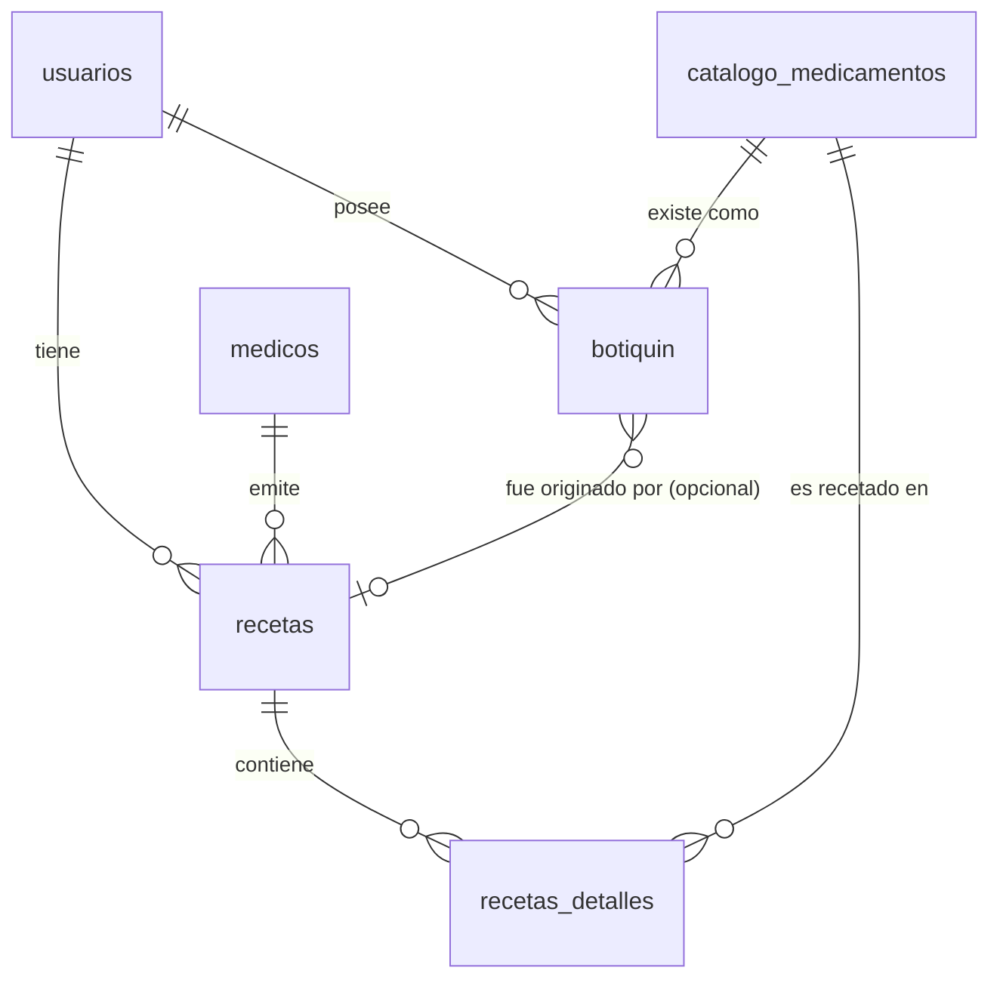

# Arquitectura de la Base de Datos - BDI Medical

Este documento expone el diseño normalizado de la base de datos para el Proyecto Terminal. Detalla el propósito de cada tabla y cómo las entidades se relacionan entre sí.

## 1. Justificación del Diseño

Durante las primeras versiones del sistema, se manejaba una estructura simplificada donde la tabla `medicamentos` almacenaba tanto la información clínica recetada por un doctor (instrucciones, dosis) como la información del inventario del usuario (cantidad disponible, fecha de caducidad). 

Esto presentaba una deficiencia arquitectónica clave: **mezclaba un documento prescriptivo (receta) con el inventario físico (botiquín).** 

Para resolver este problema y cumplir con los estándares de la Tercera Forma Normal (3NF), el diseño evolucionó separando los dominios en tres pilares fundamentales:
1. **Catálogos Maestros**: Diccionarios inmutables de información (Enfermedades y Medicinas).
2. **Historial Clínico**: Las recetas prescritas al usuario.
3. **Botiquín Personal**: La existencia física de la medicina en poder del usuario.

## 2. Descripción de Tablas y Relaciones

### 2.1 Tablas Base (Catálogos y Usuarios)

*   **`usuarios`**: Almacena las cuentas registradas a través de Google OAuth. 
    *   *Propósito*: Control de acceso. Todos los registros médicos y de inventario se ligan a esta tabla.
*   **`medicos`**: Almacena los doctores detectados por el sistema OCR.
    *   *Propósito*: Llevar un historial de quién prescribió cada receta, permitiendo auditorías de validación de cédulas.
*   **`catalogo_cie10`**: Diccionario estándar de enfermedades de la OMS.
    *   *Propósito*: Permite que el motor de Procesamiento de Lenguaje Natural (NLP) mapee coloquialismos (ej. "me duele la panza") a diagnósticos clínicos precisos (ej. "R10.4 Otros dolores abdominales").
*   **`catalogo_medicamentos`**: Diccionario estandarizado de fármacos.
    *   *Propósito*: Evita el almacenamiento de nombres duplicados, con faltas de ortografía o redundantes que suelen ocurrir al extraer texto por OCR. Estándar centralizado de qué medicinas son conocidas por el sistema.

### 2.2 Tablas Transaccionales (Clínicas e Inventario)

*   **`recetas`**: Encabezado del documento médico. 
    *   *Relación*: `id_usuario` (Dueño de la receta) y `id_medico` (Emisor).
    *   *Propósito*: Guardar los datos generales de la consulta (fecha, diagnóstico).
*   **`recetas_detalles`**: Las filas individuales de la receta.
    *   *Relación*: `id_receta` y `id_catalogo` (El medicamento del diccionario maestro).
    *   *Propósito*: Registrar lo que el doctor ordenó. **NO representa inventario**. Aquí se guardan datos prescriptivos puros como `dosis` e `instrucciones_uso`.
*   **`botiquin`**: El inventario real y físico en la casa del usuario.
    *   *Relación*: `id_usuario`, `id_catalogo` y (opcionalmente) `id_receta`.
    *   *Propósito*: Llevar el control de cajas de medicinas reales, sus cantidades y cuándo caducan. Permite al usuario registrar un medicamento libremente sin necesitar un antecedente clínico (por lo que `id_receta` es anulable).

## 3. Diagrama Entidad-Relación (Conceptual)

## 4. Ventajas de la Refactorización

1. **Escalabilidad**: Es posible agregar módulos de alertas de caducidad leyendo exclusivamente de `botiquin`.
2. **Trazabilidad**: Si el usuario agrega Paracetamol, el sistema sabe exactamente qué ID tiene, unificando la búsqueda.
3. **Limpieza de Datos**: Se elimina la redundancia de guardar múltiples veces "Ácido Acetilsalicílico" como cadena de texto por cada usuario.
